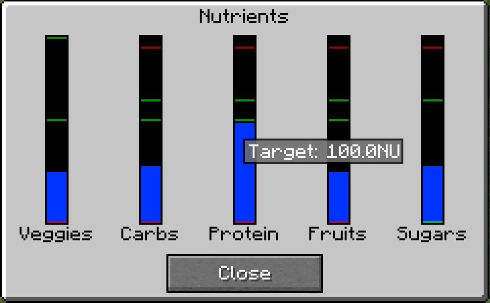

## About
This is a Minecraft mod that enhances the food system to encourage you to eat a balanced diet.
Eating a variety of nutrients with the right balance will make you stronger and faster.
Ignoring your nutritional balance, however, can slow you down and weaken you.

This mod is easy to configure to your liking.
Nutrients are defined by item tags which can be customized with Data Packs
and further configured in the server-side configuration file.
All these customizations can be reloaded live, in-game.
Only raw ingredients need be tagged, since the mod will traverse through crafting ingredients
to discover a food's nutrients.

## How to Play
Each food in Minecraft will have one or more nutrients. Hover over a food item to see which
nutrients it provides along with the total number of Nutritional Units (NUs).

When you eat food, you will gain the nutritional units provided by the food divided among
the nutrients it provides. You will want to eat foods that provide a variety of nutrients and
avoid eating too much of a single nutrient.

To see how you are doing, press the 'n' key (configurable). This will bring up the Nutrients GUI.

The blue shaded areas show your current level of each nutrient.
The horizontal green lines show the boundaries of the "target" area.

Get <ins>all</ins> of your nutrients in the target areas to achieve a balanced diet and get a few buffs.
The horizontal red lines at the bottom show the "malnourishment" boundaries, and
the red lines at the top show the "engorgement" boundaries. Avoid letting your nutrient levels
cross these boundaries or you will get some minor debuffs.

Notice that some nutrients have different targets. Sugar is a "non-essential" nutrient,
which means it does not count against your target as long as it stays below top target boundary,
and it never causes malnourishment.
Veggies are always good. As long the level is above the lower target boundary, it will count toward your target.
You can eat as many veggies as you want, and it will not cause engorgement.

Nutritional Balance doesn't make it super difficult to keep your nutrients balanced
as long as you don't ignore them completely.

## Customization and Integration

By default, this mod supports vanilla foods, Simple Farming and Pam's Food Core with the 5 nutrients shown
in the screenshot above.

### Changing and Adding Nutrients
Nutrients are defined by item tags which can be customized with Data Packs.
Items tagged with forge:nutrient/*nutrientname* will get the nutrient defined by *nutrientname*.
In this way you can easily use data packs within your modpack or mod to add nutrients to foods and even create
new nutrients.

Alternatively, you can use the config file to simply add item ids (i.e."modname:itemname:)
and tags (i.e. "#forge:tag") to the predefined nutrients.

Keep in mind that only raw ingredients need be tagged. Nutritional Balance will traverse through crafting
ingredients to discover a food's nutrients.

To add new nutrients, simply add a tag to any food with the name of your new nutrient.
For instance, if you want to add a Dairy nutrient, create a dairy.json file in your datapack at 
data/forge/tags/items/nutrients/dairy.json. Your foods will then have the tag forge:nutrients/dairy.
You will then need to add localization text for "nutritionalbalance.nutrient.dairy".

### Adjusting Levels

All levels can be adjusted in the server config file located inside the serverConfig folder inside your world folder.
You can change the target, upper and lower limits, initial value, increment rate, decay rate,
and which nutrients are "non-essential" and which are "always good".

### A note about config files

In 1.16.4, server side configs are stored inside the world file in a folder called serverConfig.
You will not find this config file until you create a world.
If you want your config changes to apply to all worlds in a pack, you need to copy it from the
world/serverConfig folder to the defaultconfigs folder at the Minecraft instance root.

## Issues and Feature Requests

Please submit bugs and feature requests using the Issues link above. Be sure to include the mod version,
forge version and any relevant crash reports.
This mod is in early beta, and therefore, may has some bugs and minor design issues.
If you do find any problems or have ideas for improvements, I would be most grateful for your input.